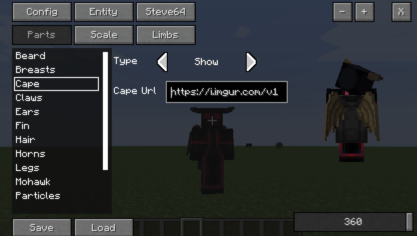
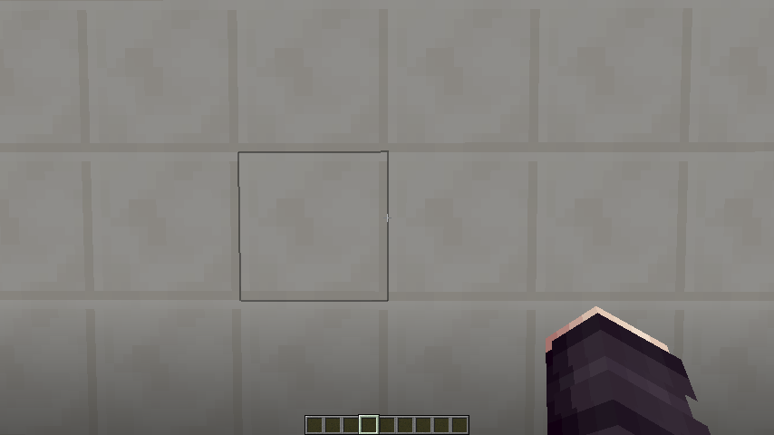
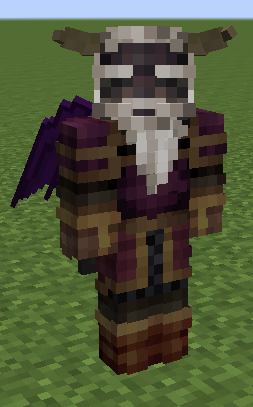

## 👋 Welcome to the MorePlayerModels+ Repository.
  

> ModePlayerModels+ is a [Minecraft](https://minecraft.net/) mod that allows you to customize your player with different body parts. ModePlayerModels+ is only a branch version of the **1.7.10** Forge version of the original (down below) and has no plans to add or update any other version. This is not an official version of ModePlayerModels.

Link to CurseForge: [HERE](https://www.curseforge.com/minecraft/mc-mods/moreplayermodels-plus)

### ❗ Notice
I am not the original creator of MorePlayerModels. The original creator is @[Noppes](https://github.com/Noppes). I have been permitted to update the 1.7.10 and post my results on GitHub. The original mod that is updated to the latest versions of Minecraft can be found on these links: [CurseForge](https://www.curseforge.com/minecraft/mc-mods/more-player-models), [kodevelopment](http://www.kodevelopment.nl/minecraft/moreplayermodels/)

### 🔹 Installation
This mod is an ***update*** to MorePlayerModels and not an add-on. Do not install MorePlayerModels with MorePlayerModels-Plus. MorePlayerModels-Plus does not remove any functional features from the original mod. It expands upon MorePlayerModels with original features and backported features from newer versions. Simply drag MorePlayerModels-Plus into any client/server mods folder to utilize. Please **backup** before using as this could still have unforeseen errors. Report any bugs if found, thank you and enjoy.

### ❓ Features:
- 64x64 Skin Textures work on all models
- 1.8 Skins  (64x64)
- Alex Model (64x64)
- Capes Integration!
- Fix Part Rendering
- Backported GUI Features
- Backported New Part Models
- Custom Part Disabling

--- Please Suggest New Features!

## 🔰 Images:

#### New GUI:

#### POV:

#### Steve64:

## 🔗 Want to check out my other projects?
[CustomNPC+](https://github.com/KAMKEEL/CustomNPC-Plus) is a mod designed to continue the 1.7.10 branch of CustomNpcs. It is intended to be used with MorePlayerModels+.

[Plugin Mod](https://github.com/KAMKEEL/Plugin-Mod) is a mod designed to add more aesthetic items for RPG and storytelling. It is compatible with CustomNPC+ and has many items intended to be used and wielded by created NPCs.

[RPG Messenger](https://github.com/KAMKEEL/RPGMessenger) is a bukkit plugin designed to allow operators to create messagable NPCs for RPG Servers. Allows a 'RPG Controller' to reply quickly as NPCs, form groupchats, and messagable parties.

[CustomNPC+ Dark Mode](https://github.com/KAMKEEL/CustomNPC-Plus-Dark-Mode) is a resource pack for CustomNPC+ that alters all GUIs within the mod to a dark variant that is both clean and pleasing to look at.

